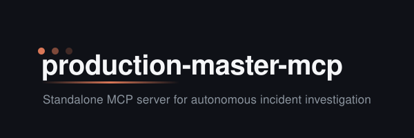
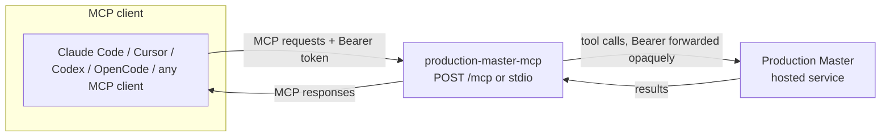

<p align="center"></p>

<p align="center">
  <a href="https://github.com/ProductionMasterAI/production-master-mcp/actions/workflows/ci.yml"></a>
  <a href="LICENSE"></a>
  <a href="https://claude.ai/code"></a>
  <a href="https://github.com/ProductionMasterAI"></a>
  <a href="CHANGELOG.md"></a>
</p>

<p align="center">
  
  
  
  
</p>

---

**The standard MCP server for the Production Master hosted incident-investigation service — connect any MCP client and drive investigations as tool calls.**

`production-master-mcp` speaks the [Model Context Protocol](https://modelcontextprotocol.io). It exposes the Production Master tool set to any MCP-capable client — Claude Code, Cursor, Codex, OpenCode, or anything else that speaks MCP — and relays each tool call to the hosted service. The intelligence runs on the service; this server is the protocol front door in front of it.

Authentication is **pass-through**: the client supplies an `Authorization: Bearer <token>` header, the server forwards it opaquely to the hosted service, and it stores no credentials of its own. Tool input/output schemas come from the shared npm package [`@production-master/mcp-tool-contract`](#architecture) (publication pending), so every client sees the same, versioned tool surface.

## Features

- **Standard MCP, any client** — one server, reachable from Claude Code, Cursor, Codex, OpenCode, or any MCP-capable client. No per-editor fork.
- **Two transports** — Streamable HTTP (`POST /mcp`) for hosted/remote use, and stdio for running locally next to your client.
- **Pass-through auth** — the caller's bearer token is forwarded opaquely upstream and never stored, logged, or persisted by the server.
- **Contract-driven tools** — tool schemas are published in `@production-master/mcp-tool-contract`, keeping the tool surface stable and versioned across clients.

## Prerequisites

- **Node.js 22** (see [`.nvmrc`](.nvmrc) once packages land)
- **Access to the Production Master hosted service** — the server forwards your bearer token to it; you supply that token from your MCP client.
- An MCP-capable client: Claude Code, Cursor, Codex, OpenCode, or any client speaking MCP.

## Quick Start

> **Status:** the server packages under [`packages/`](packages/) are being populated via PRs. The connection patterns below describe how a client registers an MCP server over each transport; the concrete package name and endpoint land with those PRs. See [CHANGELOG](CHANGELOG.md).

There are two ways to connect, matching the two transports:

### Over HTTP (`POST /mcp`)

Point your MCP client at the server's HTTP endpoint and pass your token as a bearer header. With Claude Code (available once the first packages land):

```
claude mcp add --transport http production-master <server-url>/mcp \
  --header "Authorization: Bearer <your-token>"
```

Any HTTP-capable MCP client can connect the same way — give it the `<server-url>/mcp` endpoint and an `Authorization: Bearer <token>` header.

### Over stdio (local)

Run the server as a local subprocess of your client. With Claude Code (available once the first packages land):

```
claude mcp add production-master -- npx -y @production-master/mcp
```

For other clients, register a stdio MCP server that launches the same command. Full walkthrough: [docs/user/quick-start.md](docs/user/quick-start.md).

## Architecture

The server is a thin protocol boundary: it terminates MCP, forwards tool calls to the hosted service, and streams results back. It holds no investigation logic and no stored credentials.



Three concerns live here: **transport** (Streamable HTTP `POST /mcp` and stdio), **auth pass-through** (forward the caller's bearer token upstream, store nothing), and **tool routing** (validate against the schemas from `@production-master/mcp-tool-contract` and relay to the service). See [docs/engineering/architecture/overview.md](docs/engineering/architecture/overview.md).

## Documentation

| Doc | Purpose |
|-----|---------|
| [Quick Start](docs/user/quick-start.md) | Connect an MCP client over HTTP or stdio |
| [Usage](docs/user/usage.md) | Common workflows — connect from each client, bearer pass-through |
| [Commands](docs/user/reference/commands.md) | Endpoint, transports, and config reference |
| [Troubleshooting](docs/user/troubleshooting.md) | Auth (401), connectivity, Node version, transport mismatch |
| [Architecture](docs/engineering/architecture/overview.md) | Components and data flow |
| [ADR-001](docs/engineering/decisions/ADR-001-initial-architecture.md) | Standard MCP server over the hosted service |
| [Contributing](docs/CONTRIBUTING.md) | How to contribute |
| [Changelog](CHANGELOG.md) | Release history |

## License

MIT — see [LICENSE](LICENSE).
